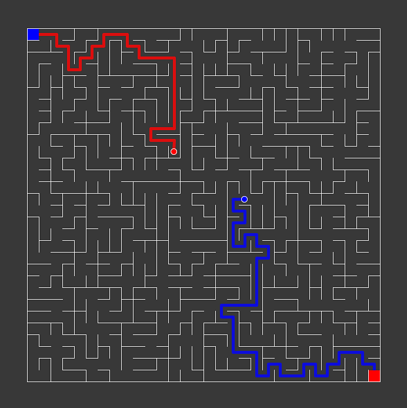

# A-maze

Playing with various maze-generating algorithms in Processing.py.

## Implemented algorithms

1. Randomized depth-first search 
2. Randomized Kruskal's algorithm
3. Randomized Prim's algorithm
4. Wilson's algorithm
5. Recursive division

## Installation

```bash
git clone https://github.com/lyova-potyomkin/a-maze.git
cd a-maze
./install.sh
```

## Usage

Run with

```bash
java -jar processing-py.jar src/main.pyde
```

Each player's goal is to get to the opposite corner of the maze. The game is completely keyboard-driven. After launch, press one of the digits keys (`1`-`5`) to select the algorithm.

Player 1 controls: `W/A/S/D`

Player 2 controls: `Arrows`

Other:
- `Shift+R` - restart
- `C` - toggle the correct path
- `P` - toggle players' paths
- `F` - toggle floodfill

## Screenshot


